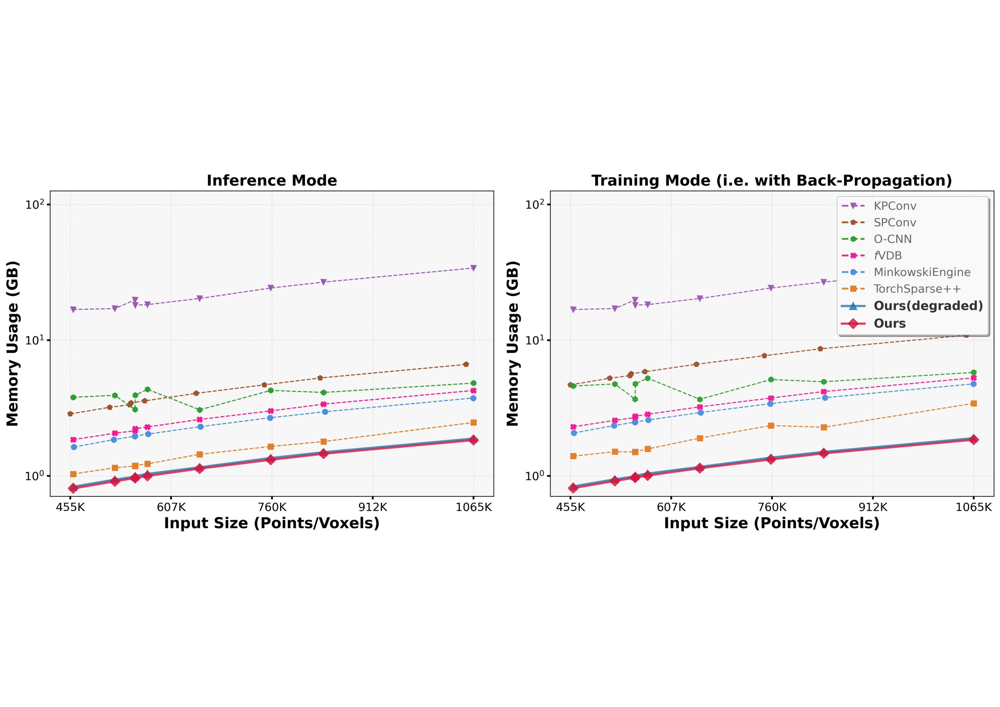
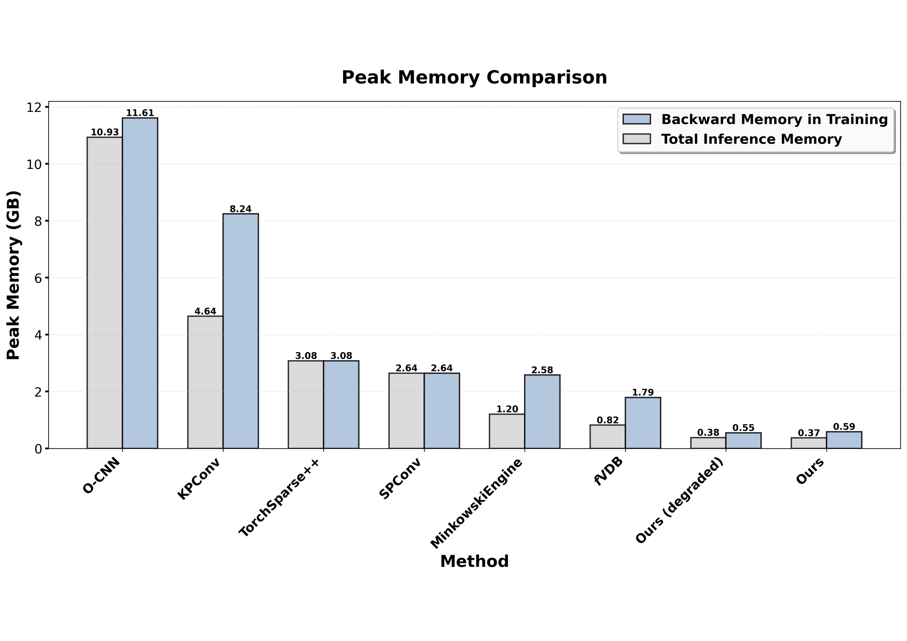
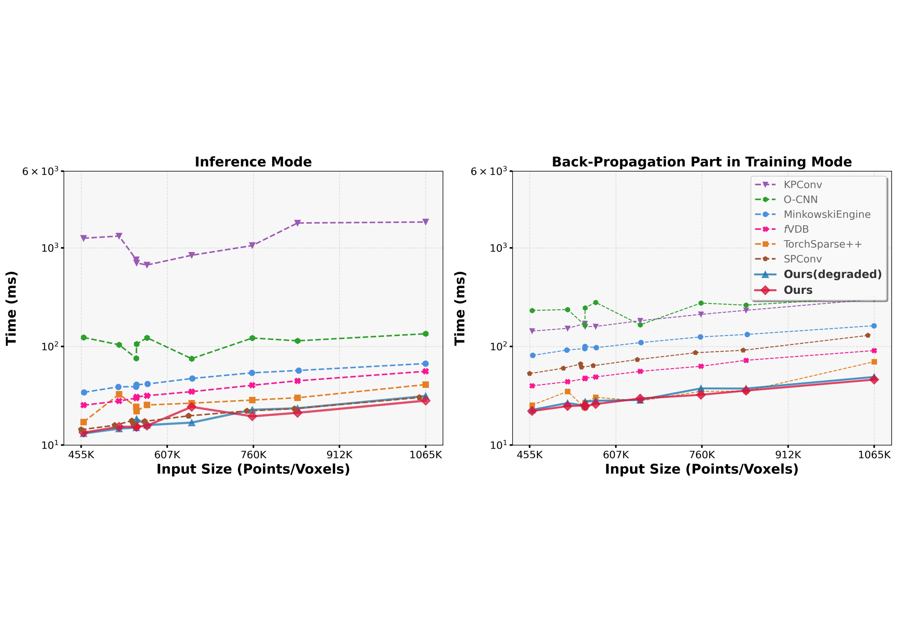
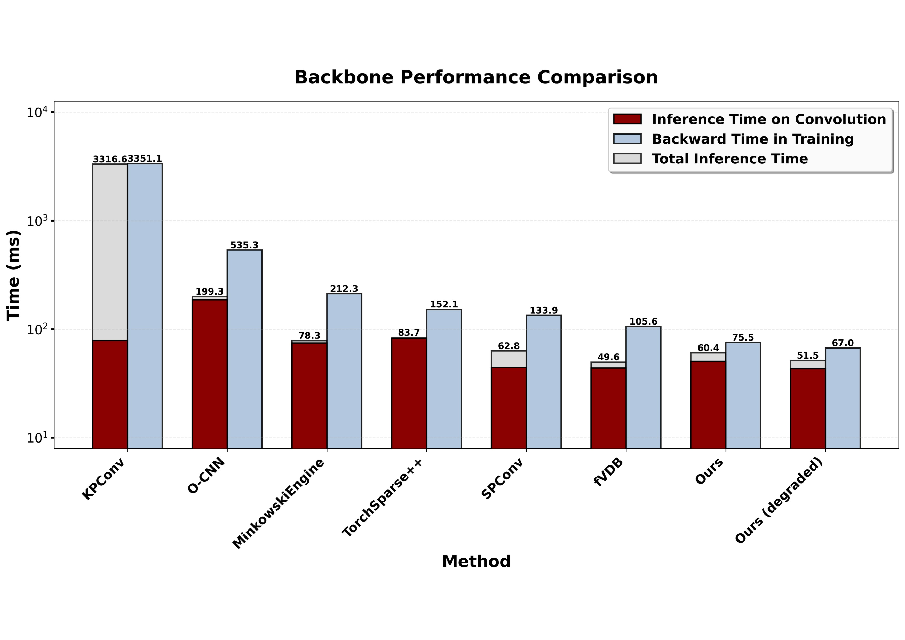

<div align="center">

<!-- Logo placeholder - replace with actual logo when available
 -->

# Pointelligence

### 🚀 Accelerating Point Cloud Learning for Spatial Intelligence

[](https://arxiv.org/abs/2511.23227)
[](https://arxiv.org/abs/2511.23227)
[](https://github.com/ant-research/pointelligence)
<!-- [](https://pytorch.org/)
[](LICENSE) -->

<p align="center">
  <a href="#-installation">Installation</a> •
  <a href="#-basic-usages">Usage</a> •
  <a href="#-citation">Citation</a> •
  <a href="#-core-concepts">Concepts</a>
</p>

</div>

---

## 📖 About

**Pointelligence** is a high-performance library for 3D point cloud deep learning research. It provides efficient GPU-accelerated primitives and ready-to-use neural network architectures for spatial intelligence tasks.

### ✨ Highlights

| Feature | Description |
|---------|-------------|
| 🎯 **PointCNN++** | Official implementation of [PointCNN++](https://arxiv.org/abs/2511.23227) (CVPR 2026) — a significant evolution of [PointCNN](https://github.com/yangyanli/PointCNN) (NeurIPS 2018) |
| ⚡ **High Performance** | Optimized CUDA kernels for native point convolution with minimal memory overhead |
| 📦 **Ragged Tensors** | Efficient batching without padding — process only valid data |
| 🔧 **Modular Design** | Build custom architectures from composable primitives |
| 🐳 **Docker Ready** | One-command setup with pre-built CUDA extensions |

---

## 📊 Performance

PointCNN++ delivers state-of-the-art performance with significantly lower memory usage and faster training times compared to existing methods.

### Memory Efficiency

Our native point-based approach fundamentally avoids the overhead of voxel-based auxiliary data structures:

<table>
<tr>
<td width="50%">
<p align="center">

<br>
<b>Figure D.</b> Memory usage comparison of one convolution layer.
</p>
</td>
<td width="50%">
<p align="center">

<br>
<b>Figure F.</b> Peak memory comparison of ResNet-18 backbones.
</p>
</td>
</tr>
</table>

### Speed Benchmarks

Our custom Triton kernels (MVMR for forward, VVOR for backward) provide exceptional speed in both inference and training:

<table>
<tr>
<td width="50%">
<p align="center">

<br>
<b>Figure E.</b> Operator-level latency analysis.
</p>
</td>
<td width="50%">
<p align="center">

<br>
<b>Figure G.</b> End-to-end ResNet-18 backbone performance.
</p>
</td>
</tr>
</table>

---

## 📥 Clone the Repository

Clone the repository with third-party submodules (FCGF and Pointcept) recursively:

```shell
git clone --recursive https://github.com/ant-research/pointelligence.git
cd pointelligence
```

For reproducibility, checkout the following commits in the submodules:

```shell
# FCGF (examples/FCGF)
cd examples/FCGF && git checkout pointcnnpp-version && cd ../..

# Pointcept (examples/Pointcept)
cd examples/Pointcept && git checkout pointcnnpp-version && cd ../..
```

If you have already cloned without `--recursive`, run `git submodule update --init --recursive` to fetch the submodules.

## 🛠️ Installation

### Option 1: Local Installation

Some operators are implemented with C++/CUDA as PyTorch extensions, which could be built and installed with the following commands:

```shell
conda create -n pointelligence python=3.10 -y
conda activate pointelligence
pip install -r requirements.txt
cd extensions
pip install --no-build-isolation -e .
```

### Option 2: Docker Installation

Use Docker for a containerized environment with all dependencies pre-installed:

```shell
# Build the Docker image
docker build -t pointelligence .

# Test the containerized environment
docker run --gpus all -it -v $(pwd):/workspace pointelligence

# Verify installation
python -m pytest tests/unittest/ -v
```

The Docker image includes:
- CUDA 12.4 + cuDNN + PyTorch 2.6.0+ with GPU support
- Pre-built CUDA extensions (`sparse_engines_cuda`)
- All system dependencies and Python packages
- Sample data preloaded
- Ready-to-use development environment

## 💡 Basic Usages

### Point Cloud Registration Task

See `examples/FCGF` for a full training pipeline using [Fully Convolutional Geometric Features](https://github.com/chrischoy/FCGF) with PointCNN++ as the backbone.

### Point Cloud Segmentation Task

See `examples/Pointcept` for semantic segmentation using the [Pointcept](https://github.com/Pointcept/Pointcept) framework with PointCNN++ integration.

## 📚 Citation
Pointelligence is the repo for the official implementation of:
* [PointCNN++: Performant Convolution on Native Points](https://arxiv.org/abs/2511.23227)\
    [Lihan Li](https://lihhan.github.io/), Haofeng Zhong, Rui Bu, Mingchao Sun, [Wenzheng Chen](https://wenzhengchen.github.io/), [Baoquan Chen](https://baoquanchen.info/), [Yangyan Li](https://yangyan.li)
    ```text
    @misc{li2025pointcnnperformantconvolutionnative,
          title={PointCNN++: Performant Convolution on Native Points}, 
          author={Lihan Li and Haofeng Zhong and Rui Bu and Mingchao Sun and Wenzheng Chen and Baoquan Chen and Yangyan Li},
          year={2025},
          eprint={2511.23227},
          archivePrefix={arXiv},
          primaryClass={cs.CV},
          url={https://arxiv.org/abs/2511.23227}, 
    }
    ```
  
## 🐛 Feature Requests and Issues
To ensure they are tracked effectively, please submit feature requests and issue reports here rather than via email.


## 🔬 Core Concepts

For building custom architectures, see **[docs/ADVANCED.md](docs/ADVANCED.md)** covering:
- **Ragged tensors** — efficient batching without padding
- **Neighborhoods** — fixed-radius search producing (i, j) pairs
- **Convolution triplets** — extending (i, j) to (i, j, k) to route data through kernel weights
- **MVMR** — the sparse convolution operator: `output[i] += weight[k] @ input[j]`

